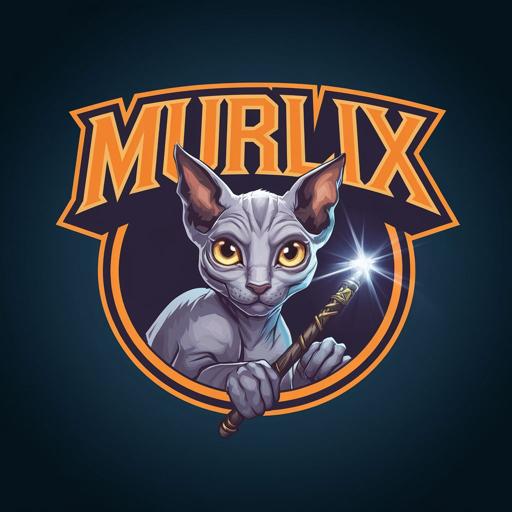

# Murlix - World of Warcraft Rotation Automation Tool 🧙‍♂️⚔️

  

Hello! 👋 Murlix is a rotation automation tool for World of Warcraft based on the [Hekili Priority Helper](https://www.curseforge.com/wow/addons/hekili) addon. The program automatically presses abilities according to Hekili's recommendations. Seeing the high prices for similar tools, I decided to share my version with the community. 💡

## Key Features ✨

- **Easy Setup:** The modern GUI allows you to configure the program to work with Hekili effortlessly. 🛠️
- **Security:** Murlix does not inject into the game's memory, alter game files, or interfere with the video driver API. It operates through standard Windows APIs, making it appear as normal system behavior. 🔒
- **Player Behavior Simulation:** The program can simulate human errors and delays, making its use safer. 🕹️
- **User-Friendly:** Pin the program window on top of your screen and easily configure each ability. 🖥️
- **Custom Logic:** Create your own WeakAuras with the desired pixel colors to manage ability pressing logic. 🧩

## Setup Instructions 🚀

1. **Install the Hekili addon.** [Hekili on CurseForge](https://www.curseforge.com/wow/addons/hekili)
2. **Launch Murlix** and pin the program window on top of your screen. 📌
3. **Point to the ability icon** in Hekili and press the End key to open the dialog. 🔍
4. **Enter the key** corresponding to the ability and click OK. ✅
5. **Repeat the process** for all abilities. 🔄
6. **Press the rotation activation key** (default Home). 🏠
7. **Enjoy the game!** 🎮

## Security 🔐

Murlix is designed with multiple layers of security, including code obfuscation, encryption, and process masking. However, always remember that using such tools carries a certain risk, although in two years of active use, I haven't been detected by anti-cheat systems. ⚠️

If the community finds this program useful, I will continue to develop it based on your feedback and suggestions. 🌟

Feel free to open issues or contribute to the project! 🛠️

---

**Disclaimer:** This tool is designed to enhance the gaming experience and fully complies with World of Warcraft's rules and guidelines. Use it responsibly and within the boundaries of the game's policies.
